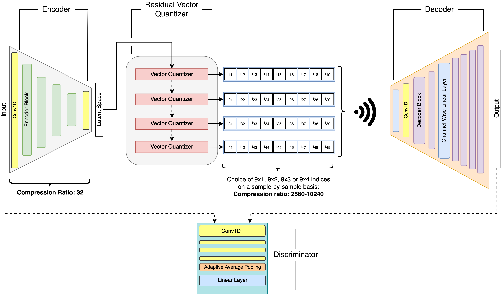

# EdgeCodec
EdgeCodec: Onboard Lightweight High Fidelity Neural Compressor with Vector Quantization

## Introduction

On this git you will find the essentials to _EdgeCodecs_ structure, training and evaluation as described in the [paper](https://arxiv.org/abs/2507.06040). _EdgeCodec_ relies on [lucidrains vector-quantize-pytorch](https://github.com/lucidrains/vector-quantize-pytorch) repository for the residual vector quantizer implementation.

<div style="background-color: white; padding: 10px; display: inline-block;">
  
</div>


## Dataset

This git does NOT provide the original _AeroSense_ dataset, which _EdgeCodec_ is trained on. For access to the dataset and it's associated processing library _Aerolib_ please contact @tommasopolonelli. 

If you want to test the code as it is, you will need to provide tensors of shape _batch_size_ x 36 x 800. The [C-code](./embedded-rvq/) should be able to run out of the box with ***Frvq.c*** as default in the *CMakeLists*. But the C part has a separate [ReadMe](./embedded-rvq/README.md) which explains it all.

## Requirements

I would recommend a regular python/conda enviromnent if you want to use an associated dataset since you avoid the headache of mounts in Docker Images, but those can obviously also be made from this and the associated [requirements.txt](requirements.txt).

## To run python section

Create an enviromnent 

``` bash
python -m venv env
source env/bin/activate # you should have an (env) next to your console line
pip install -r requirements.txt
```

Now you should be ready to run any of the python files in [main_scripts](./main_scripts). Please be aware that I put in generic paths to model files, dataset etc. In the code itself I've described what every single path "should" point, the way I set it up. So either .pt files or configs or anything really.